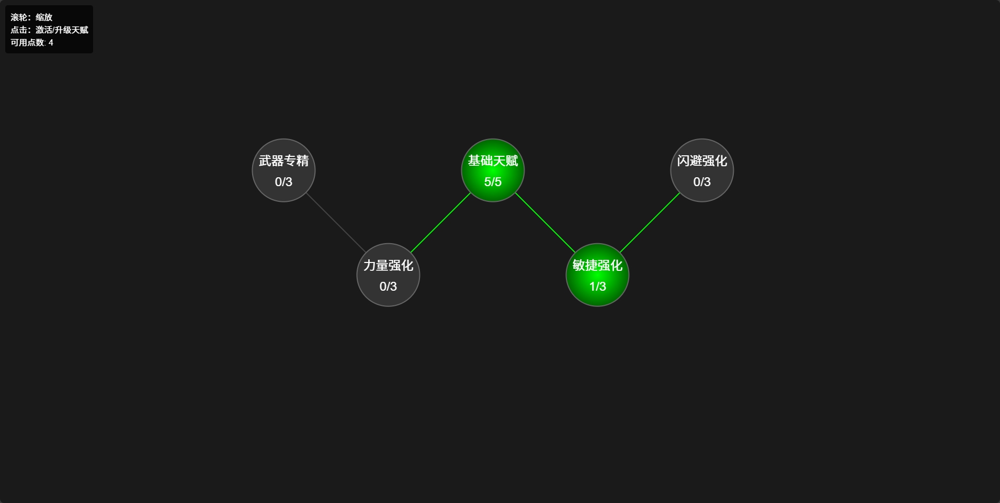

# interactive-talent-tree# 天赋树系统 (Talent Tree System)

一个基于HTML5 Canvas的互动天赋树系统，使用纯JavaScript实现。

## 效果展示

## 功能特点

- 可视化天赋树结构
- 动态天赋点数分配
- 天赋等级升级系统
- 前置天赋要求
- 交互式缩放和查看
- 实时视觉反馈

## 使用说明

1. 可用天赋点数：初始10点
2. 操作方式：
   - 使用鼠标滚轮进行画面缩放
   - 点击天赋节点进行升级
   - 需要先满足前置天赋要求才能升级后续天赋

## 技术栈

- HTML5 Canvas
- 原生JavaScript
- CSS3

## 本地运行

直接在浏览器中打开 `index.html` 文件即可运行。